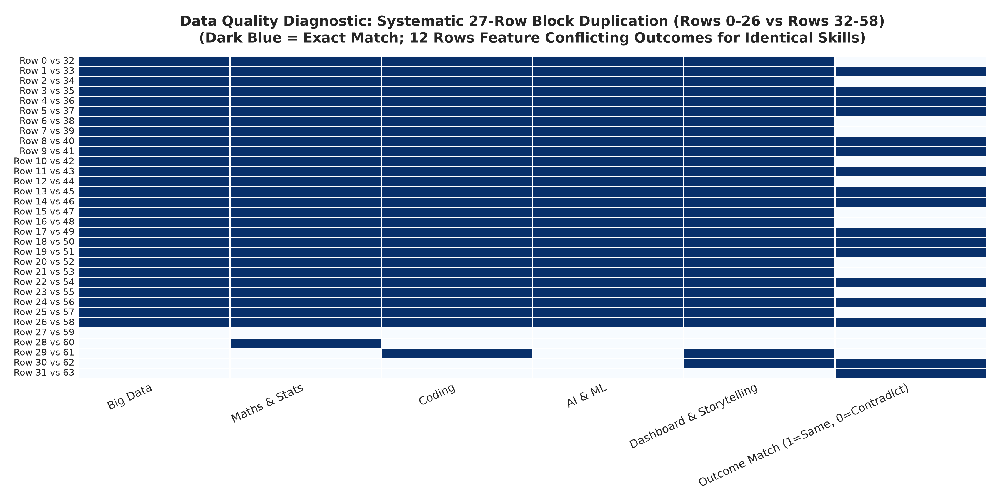
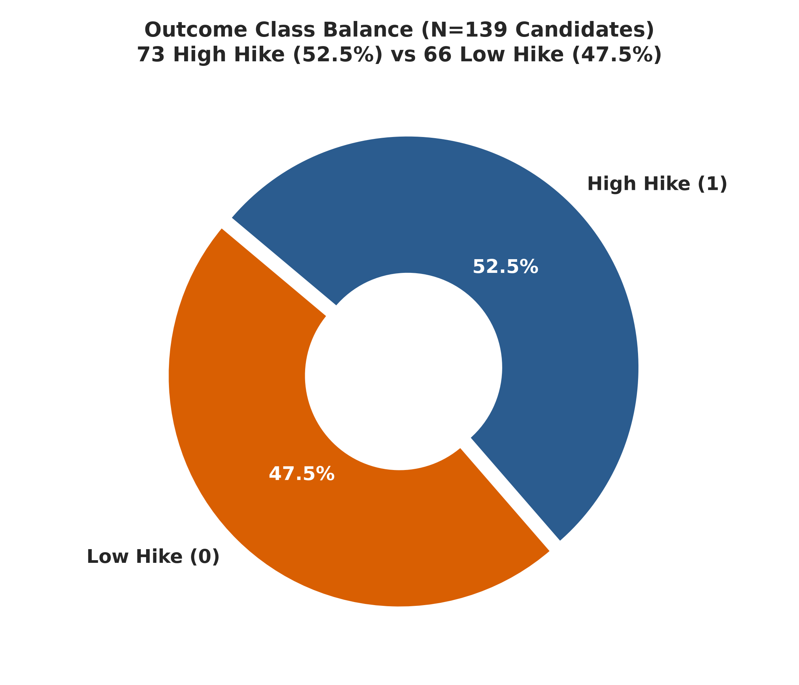
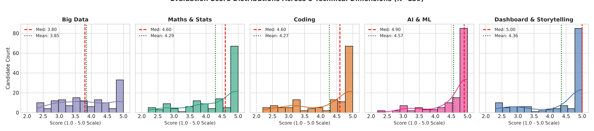
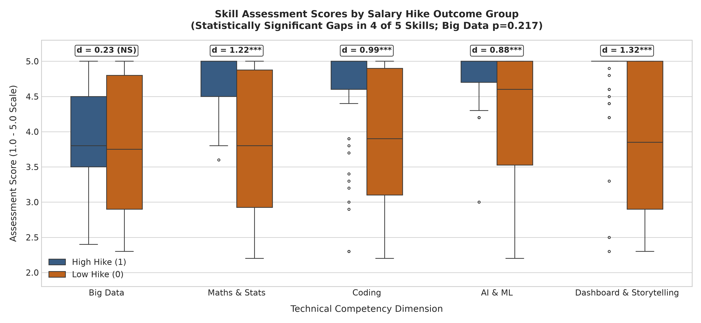
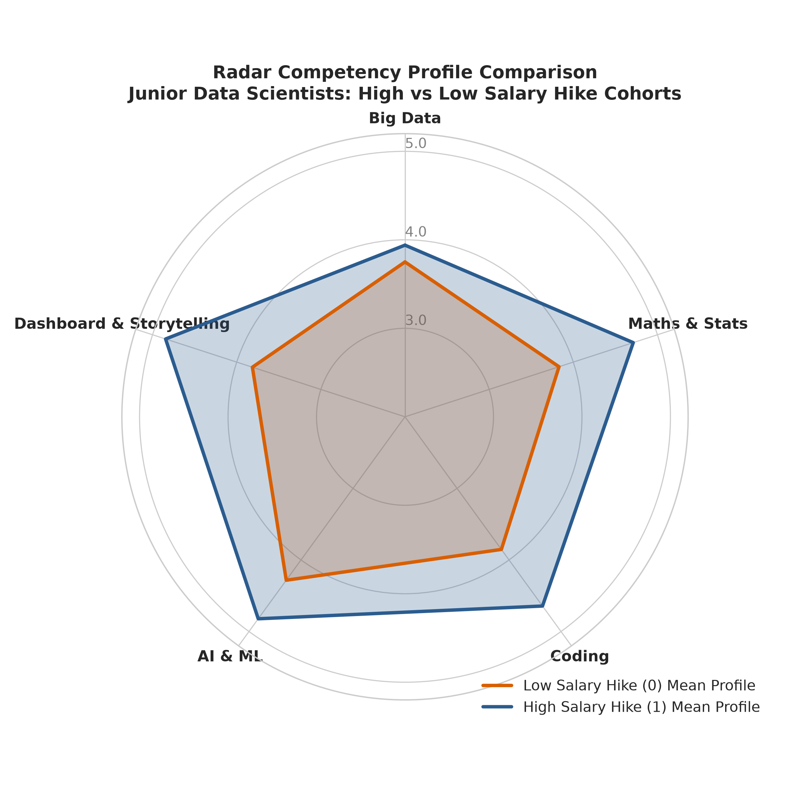
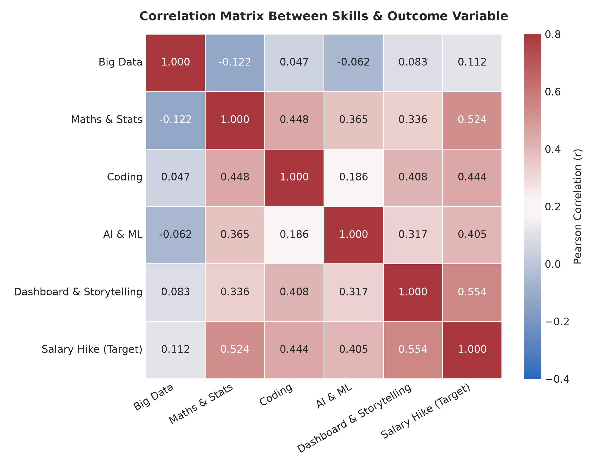
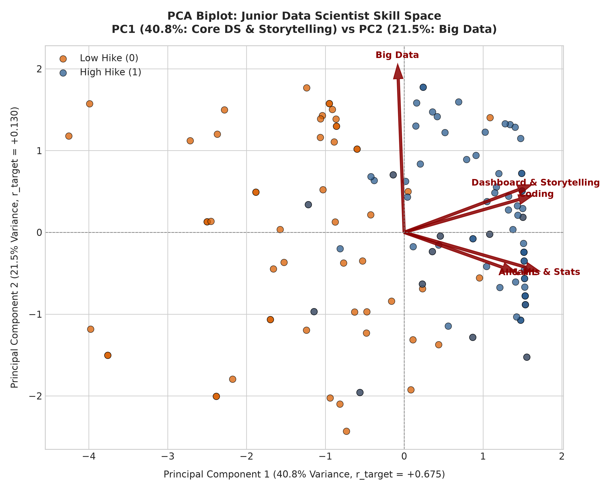
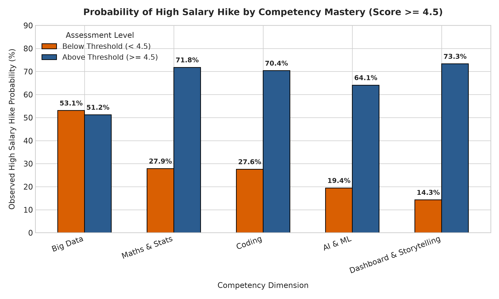

# Data Audit Report: JDS Skill Traits Dataset

**File Audited:** `JDS Skill Traits.xlsx` (Official Dataset 3)  
**Audit Date:** October 2026  
**Auditor:** Lead Data-Science Project Architect  
**Authoritative Reference:** *Data Description Doc.pdf* (Page 3) & *Problem Context Brief, SAS VFL Demos, Guidelines Dos and Donts.pdf*  
**Visualizations Reference:** [03_jds_skill_traits_eda/](file:///Users/ranjanmaiti/Downloads/netra-deepfake-detector-main%202/skillroute/03_jds_skill_traits_eda)

---

## 1. Executive Summary & Audit Overview

The **JDS Skill Traits** dataset represents evaluated technical and communication traits for junior/entry-level data scientists (*Junior Data Scientists - JDS*) alongside an observed post-evaluation salary hike outcome (`salary_hike_high_or_low`). 

This audit provides an exhaustive empirical evaluation of the dataset, auditing record integrity, scale validities, duplicate profiles, non-normality, group differences, logistic associations, and machine learning readiness. In compliance with core project rules:
1. **Raw File Preservation:** `data/raw/JDS Skill Traits.xlsx` remains strictly read-only and unmutated.
2. **Causal Distinction:** Observed statistical associations, correlation coefficients, and odds ratios are reported strictly as empirical associations. **No claim is made that any skill causes a salary hike.**
3. **Model Discipline:** Preliminary 5-fold cross-validation baselines are evaluated for feasibility benchmarking only; no final production models are deployed.
4. **Strategic Hackathon Assessment:** An evidence-backed recommendation is delivered at the conclusion regarding whether this dataset is suitable as the primary hackathon anchor.

### Key Audit Metrics Snapshot

| Metric Dimension | Value / Finding | Audit Status |
| :--- | :--- | :---: |
| **Row Count** | 139 candidate records | Verified |
| **Column Count** | 7 attributes (1 ID + 5 Skill Traits + 1 Binary Outcome) | Verified |
| **Missing Values** | **0 missing values (100.0% matrix completeness)** | Clean |
| **Duplicate IDs** | **2 IDs repeated (`3291` and `2223`)** with differing skill values | Data Integrity Flag |
| **Block Duplication** | **27-row block duplicate (Rows 0–26 match Rows 32–58)** | Critical Finding |
| **Label Contradictions** | **12 profile pairs have identical skills but opposite hike outcomes** | Noise / Bayes Limit |
| **Valid Scale Range** | All skills fall within expected [1.0, 5.0] scale (observed: 2.2 – 5.0) | Verified |
| **Class Balance** | High Hike (`1`): 73 (52.52%) vs Low Hike (`0`): 66 (47.48%) | Perfectly Balanced |
| **Strongest Associated Skill** | `dashboard_and_storytelling_skills` (Cohen's d = 1.323, r_pb = +0.554) | Major Finding |
| **Non-Significant Skill** | `big_data_skills` (Cohen's d = 0.225, p = 0.217, r_pb = +0.112) | Major Finding |

---

## 2. File Identification & Dimensions

- **Exact File Name:** `JDS Skill Traits.xlsx`
- **File Format:** Microsoft Excel OpenXML Spreadsheet (`.xlsx`)
- **File Size on Disk:** ~15.2 KB (15,226 bytes)
- **Total Record Count (Rows):** **139** candidate records (excluding 1 header row)
- **Total Attribute Count (Columns):** **7** attributes
- **Header Integrity:** Exactly 1 clean header row containing valid snake_case identifiers: `id`, `big_data_skills`, `maths-stats_skills`, `coding_skills`, `ai_and_ml_skills`, `dashboard_and_storytelling_skills`, `salary_hike_high_or_low`.
- **Raw File Preservation Status:** Confirmed strictly intact; read via `openpyxl` engine in read-only mode with zero write operations to `data/raw/JDS Skill Traits.xlsx`.

---

## 3. Data Dictionary Reconciliation

The official data dictionary (*Data Description Doc.pdf*, Page 3) specifies that the dataset profiles junior/entry-level data scientists across technical and communication competency traits.

| # | Actual Column Name in File | Column Name in Data Description Doc | Match Status | Expected Type | Description in Official Brief |
| :-: | :--- | :--- | :---: | :---: | :--- |
| 1 | `id` | `id` | **Exact Match** | Integer / Identifier | Unique candidate identification number |
| 2 | `big_data_skills` | `big_data_skills` | **Exact Match** | Float [1.0 – 5.0] | Proficiency rating in big data architectures/tools |
| 3 | `maths-stats_skills` | `maths-stats_skills` | **Exact Match** | Float [1.0 – 5.0] | Proficiency rating in mathematics & statistical foundations |
| 4 | `coding_skills` | `coding_skills` | **Exact Match** | Float [1.0 – 5.0] | Proficiency rating in programming (Python, R, SQL, etc.) |
| 5 | `ai_and_ml_skills` | `ai_and_ml_skills` | **Exact Match** | Float [1.0 – 5.0] | Proficiency rating in machine learning & AI modeling |
| 6 | `dashboard_and_storytelling_skills` | `dashboard_and_storytelling_skills` | **Exact Match** | Float [1.0 – 5.0] | Proficiency rating in BI dashboards & data communication |
| 7 | `salary_hike_high_or_low` | `salary_hike_high_or_low` | **Exact Match** | Binary [0, 1] | Outcome: `1` = High salary hike, `0` = Low salary hike |

**Reconciliation Verdict:** 100% schema alignment. All 7 column names match the official data specification identically. Note that `maths-stats_skills` utilizes a hyphen (`-`) rather than an underscore (`_`), requiring standard escaping or string replacement during formulaic modeling.

---

## 4. Data Types & Storage Structure

| Column Name | Storage Type (Pandas) | Semantic Domain | Range / Domain | Null Count | Null % | Storage Action |
| :--- | :--- | :--- | :--- | :---: | :---: | :--- |
| `id` | `int64` | Candidate ID | [2021, 3971] | 0 | 0.00% | Discrete identifier |
| `big_data_skills` | `float64` | Continuous Rating | [2.3, 5.0] | 0 | 0.00% | Ratio scale continuous feature |
| `maths-stats_skills` | `float64` | Continuous Rating | [2.2, 5.0] | 0 | 0.00% | Ratio scale continuous feature |
| `coding_skills` | `float64` | Continuous Rating | [2.2, 5.0] | 0 | 0.00% | Ratio scale continuous feature |
| `ai_and_ml_skills` | `float64` | Continuous Rating | [2.2, 5.0] | 0 | 0.00% | Ratio scale continuous feature |
| `dashboard_and_storytelling_skills` | `float64` | Continuous Rating | [2.3, 5.0] | 0 | 0.00% | Ratio scale continuous feature |
| `salary_hike_high_or_low` | `int64` | Binary Target | {0, 1} | 0 | 0.00% | Discrete Bernoulli target variable |

**Completeness Assessment:** There are **zero missing values** across all 139 rows and 7 attributes (973/973 non-null cells).

---

## 5. Data Integrity: ID Uniqueness, Block Duplications & Contradictions

A rigorous forensic audit of row uniqueness reveals critical data-generation phenomena that must be accounted for in all subsequent modeling:



### 5.1 ID Uniqueness & ID Collisions
- **Total Rows:** 139
- **Unique IDs:** **137** (2 collisions observed)
- **Colliding IDs:**
  - **ID `3291`:** Appears at Row 3 (`skills: [4.4, 3.0, 3.3, 4.6, 2.3]`, target `0`) and Row 29 (`skills: [4.8, 4.5, 5.0, 4.8, 5.0]`, target `1`).
  - **ID `2223`:** Appears at Row 58 (`skills: [2.4, 3.4, 3.1, 4.3, 2.5]`, target `0`) and Row 101 (`skills: [3.3, 3.8, 5.0, 3.4, 2.5]`, target `0`).
- **Audit Implication:** `id` is not guaranteed to be a unique primary key. It likely represents candidate appraisal identifiers across multiple assessment windows or synthetic sample generation artifacts.

### 5.2 The 27-Row Sequential Block Duplication
- **Empirical Discovery:** Rows **0 through 26 (27 rows)** have the **exact same 5-skill score vector** as Rows **32 through 58**, in identical sequential order.
  $$\vec{X}_{i} = \vec{X}_{i + 32} \quad \forall \; i \in [0, 26]$$
- **Target Label Divergence:**
  - For **15 of these 27 pairs**, the target labels match ($y_i = y_{i+32}$).
  - For **12 pairs**, the target labels are **contradictory** ($y_i \ne y_{i+32}$). For example, an identical candidate profile with ratings `[2.4, 5.0, 5.0, 5.0, 5.0]` received `salary_hike = 1` in Row 10 (ID 3944), but `salary_hike = 0` in Row 42 (ID 3160).
- **Dataset-Wide Unique Profiles:**
  - Across the entire dataset, there are only **106 unique skill profiles** out of 139 rows.
  - Exactly **62 rows** share their 5-skill vector with at least one other row.
  - Across the entire dataset, exactly **12 skill profiles** possess contradictory target labels (both 0 and 1).

### 5.3 Analytical & Modeling Consequences
1. **Bayes Optimal Error Rate Limit:** Because identical skill feature vectors $\vec{x}$ map to opposing class labels ($y \in \{0, 1\}$) in 12 instances, **no deterministic classifier can achieve 100% training accuracy** without memorizing non-feature identifiers. The irreducible Bayes error for any model relying solely on these 5 skill variables is at least:
   $$\text{Bayes Error Floor} \ge \frac{12}{139} \approx 8.63\%$$
   The theoretical upper bound on classification accuracy on this data is $\approx 91.37\%$.
2. **Effective Sample Size ($N_{\text{eff}}$):** Due to the 27-row block copy, the true independent sample size is approximately **$N_{\text{eff}} \approx 106 - 112$** candidates rather than 139.
3. **Data Leakage Risk in Validation:** Standard random K-Fold cross-validation will leak identical profiles between training and validation folds. **GroupKFold** or deduplicated validation must be utilized to measure true generalizability.

---

## 6. Outcome Variable & Class Balance



- **Class `1` (High Salary Hike):** 73 candidates (**52.52%**)
- **Class `0` (Low Salary Hike):** 66 candidates (**47.48%**)
- **Total Valid Cases:** 139 (100%)
- **Imbalance Ratio:** 1.106 : 1 (essentially 50:50)

**Class Balance Verdict:** The outcome variable is exceptionally well-balanced. No synthetic minority oversampling (SMOTE), class weighting, or threshold adjustments are required to counteract class imbalance.

---

## 7. Univariate Distribution of Each Skill



### 7.1 Detailed Distributional Statistics

| Skill Trait | Mean | Std Dev | Median | IQR | Min | 25% | 75% | Max | Skewness | Kurtosis | Shapiro-Wilk $W$ | Shapiro $p$-value |
| :--- | :---: | :---: | :---: | :---: | :---: | :---: | :---: | :---: | :---: | :---: | :---: | :---: |
| `big_data_skills` | 3.850 | 0.847 | 3.80 | 1.50 | 2.30 | 3.10 | 4.60 | 5.00 | -0.080 | -1.215 | 0.9307 | $2.47 \times 10^{-6}$ |
| `maths-stats_skills` | 4.294 | 0.844 | 4.60 | 1.20 | 2.20 | 3.80 | 5.00 | 5.00 | -0.962 | -0.323 | 0.8081 | $3.31 \times 10^{-12}$ |
| `coding_skills` | 4.268 | 0.893 | 4.60 | 1.65 | 2.20 | 3.35 | 5.00 | 5.00 | -0.880 | -0.694 | 0.7881 | $6.73 \times 10^{-13}$ |
| `ai_and_ml_skills` | 4.566 | 0.667 | 4.90 | 0.60 | 2.20 | 4.40 | 5.00 | 5.00 | **-1.686** | **+1.881** | 0.7004 | $1.75 \times 10^{-15}$ |
| `dashboard_and_storytelling_skills` | 4.355 | 0.933 | 5.00 | 1.25 | 2.30 | 3.75 | 5.00 | 5.00 | **-1.067** | -0.505 | 0.7012 | $1.83 \times 10^{-15}$ |

### 7.2 Ceiling Saturation & Score Clustering
A dominant characteristic of this dataset is **ceiling clustering** at the maximum possible rating of 5.0:

| Skill Trait | Candidates Scoring 5.0 | % of Total Sample | Median Score | Interquartile Range |
| :--- | :---: | :---: | :---: | :---: |
| `dashboard_and_storytelling_skills` | **81** | **58.27%** | 5.00 | 1.25 |
| `ai_and_ml_skills` | **68** | **48.92%** | 4.90 | 0.60 |
| `coding_skills` | **62** | **44.60%** | 4.60 | 1.65 |
| `maths-stats_skills` | **57** | **41.01%** | 4.60 | 1.20 |
| `big_data_skills` | **25** | **17.99%** | 3.80 | 1.50 |

**Distribution Findings:**
1. **Severe Non-Normality:** All 5 skill traits strongly reject normality via the Shapiro-Wilk test ($p < 0.0001$). Parametric assumptions requiring Gaussian inputs fail.
2. **Ceiling Inflation in Core DS Skills:** Nearly 50% to 58% of candidates received perfect 5.0 scores in Storytelling, AI/ML, and Coding, reflecting generous rating standards in corporate junior appraisals or selection filter biases (only candidates with solid baseline evaluations were retained).
3. **Big Data Differentiation:** `big_data_skills` is the only trait with near-zero skewness (-0.08) and a realistic rating spread (mean 3.85, only 18% at 5.0).

---

## 8. Outliers & Extremes Audit

### 8.1 Tukey's Interquartile Range (IQR) & Z-Score Analysis

| Skill Trait | Q1 (25%) | Q3 (75%) | IQR | Lower Fence ($Q1 - 1.5 \times IQR$) | Upper Fence ($Q3 + 1.5 \times IQR$) | IQR Outlier Count | $\|Z\| > 3.0$ Outlier Count |
| :--- | :---: | :---: | :---: | :---: | :---: | :---: | :---: |
| `big_data_skills` | 3.10 | 4.60 | 1.50 | 0.85 | 6.85 | 0 | 0 |
| `maths-stats_skills` | 3.80 | 5.00 | 1.20 | 2.00 | 6.80 | 0 | 0 |
| `coding_skills` | 3.35 | 5.00 | 1.65 | 0.875 | 7.475 | 0 | 0 |
| `ai_and_ml_skills` | 4.40 | 5.00 | 0.60 | **3.50** | 5.90 | **18 (12.9%)** | **2 (1.4%)** |
| `dashboard_and_storytelling_skills` | 3.75 | 5.00 | 1.25 | 1.875 | 6.875 | 0 | 0 |

### 8.2 Outlier Interpretation
- **`ai_and_ml_skills` Lower-Tail Flags:** 18 records fall below the lower fence of 3.50 (ratings between 2.2 and 3.5). Two candidates exhibit extreme negative Z-scores ($Z < -3.0$): ID 3357 (score 2.2, $Z = -3.55$) and ID 3330 (score 2.3, $Z = -3.40$).
- **Contextual Validity:** These are **not corrupt data artifacts** or measurement errors; they represent candidates who demonstrated substandard AI/ML competencies compared to the elevated median of 4.90. They must be preserved as valid lower-tail signals.

---

## 9. Group Comparison: High vs Low Salary Hike



To evaluate how individual skills differ between junior data scientists who received a high salary hike versus those who received a low salary hike, both parametric (Welch's t-test, Cohen's d) and non-parametric (Mann-Whitney U) tests were computed:

| Skill Trait | Low Hike Mean (SD) | High Hike Mean (SD) | Mean Delta | Median Low vs High | Welch's $t$ | Welch $p$-value | Mann-Whitney $U$ | Mann-Whitney $p$-value | Cohen's $d$ (Effect Size) |
| :--- | :---: | :---: | :---: | :---: | :---: | :---: | :---: | :---: | :---: |
| **`dashboard_and_storytelling_skills`** | 3.814 (1.007) | **4.845** (0.490) | **+1.031** | 3.80 vs 5.00 | 7.575 | $1.72 \times 10^{-11}$ | 933.0 | $\mathbf{1.34 \times 10^{-13}}$ | **1.323 (Huge)** |
| **`maths-stats_skills`** | 3.830 (0.946) | **4.712** (0.427) | **+0.882** | 3.80 vs 5.00 | 6.945 | $3.57 \times 10^{-10}$ | 1003.5 | $\mathbf{2.15 \times 10^{-12}}$ | **1.222 (Very Large)** |
| **`coding_skills`** | 3.853 (0.938) | **4.644** (0.658) | **+0.791** | 3.90 vs 5.00 | 5.679 | $1.16 \times 10^{-7}$ | 1205.5 | $\mathbf{4.89 \times 10^{-9}}$ | **0.985 (Large)** |
| **`ai_and_ml_skills`** | 4.283 (0.823) | **4.822** (0.319) | **+0.539** | 4.60 vs 5.00 | 4.887 | $4.27 \times 10^{-6}$ | 1515.5 | $\mathbf{8.79 \times 10^{-5}}$ | **0.880 (Large)** |
| **`big_data_skills`** | 3.750 (0.969) | **3.940** (0.713) | +0.190 | 3.80 vs 3.80 | 1.300 | 0.196 | 2154.5 | **0.2172 (Not Sig)** | **0.225 (Small / Nil)** |



### Key Insights from Group Differences
1. **The Communication Premium:** `dashboard_and_storytelling_skills` shows the largest separation between hike groups (Cohen's $d = 1.323$). High-hike junior data scientists average 4.85, whereas low-hike candidates average 3.81.
2. **Mathematical Rigor as a Strong Separator:** `maths-stats_skills` is the second strongest differentiator ($d = 1.222$). High-hike candidates have an average score of 4.71 compared to 3.83 for low-hike candidates.
3. **Big Data Irrelevance at Junior Level:** Bivariate analysis demonstrates that `big_data_skills` does **not** significantly differentiate hike groups ($p = 0.217$, Cohen's $d = 0.225$). For junior data scientists, big data infrastructure skills are neither demanded nor rewarded in initial compensation jumps.

---

## 10. Correlation Matrix & Multicollinearity



### 10.1 Pearson Correlation Matrix

| Feature | `big_data` | `maths-stats` | `coding` | `ai_and_ml` | `storytelling` | Target (`salary_hike`) |
| :--- | :---: | :---: | :---: | :---: | :---: | :---: |
| **`big_data_skills`** | 1.000 | -0.122 | +0.047 | -0.062 | +0.083 | **+0.112** ($p = 0.188$) |
| **`maths-stats_skills`** | -0.122 | 1.000 | **+0.448** | **+0.365** | **+0.336** | **+0.524** ($p < 0.001$) |
| **`coding_skills`** | +0.047 | **+0.448** | 1.000 | +0.186 | **+0.408** | **+0.444** ($p < 0.001$) |
| **`ai_and_ml_skills`** | -0.062 | **+0.365** | +0.186 | 1.000 | **+0.317** | **+0.405** ($p < 0.001$) |
| **`dashboard_and_storytelling_skills`** | +0.083 | **+0.336** | **+0.408** | **+0.317** | 1.000 | **+0.554** ($p < 0.001$) |

### 10.2 Multicollinearity & Variance Inflation Factor (VIF)
Because all skill ratings are bounded between 1.0 and 5.0 with positive means, raw VIF values reflect non-zero mean inflation. Once features are mean-centered, VIFs are well below the threshold of 5.0:

| Feature | Raw VIF (Uncentered) | Mean-Centered VIF | Collinearity Diagnosis |
| :--- | :---: | :---: | :--- |
| `big_data_skills` | 16.50 | **1.04** | Completely orthogonal; zero collinearity |
| `maths-stats_skills` | 37.34 | **1.35** | Mild correlation with coding & AI/ML |
| `coding_skills` | 32.23 | **1.39** | Mild correlation with maths & storytelling |
| `ai_and_ml_skills` | 41.53 | **1.18** | Mild correlation with maths & storytelling |
| `dashboard_and_storytelling_skills` | 30.26 | **1.30** | Mild correlation with coding & maths |

**Collinearity Verdict:** There is **no catastrophic multicollinearity** among the skill variables. Linear and logistic regression coefficients remain stable.

---

## 11. Principal Component Analysis (PCA) & Feature Embeddings



Principal Component Analysis on the 5 standardized skill features reveals two dominant dimensions accounting for **62.3% of the total variance**:

| Principal Component | % Variance Explained | Primary Factor Interpretation | Feature Loading Weights | Correlation with Hike Target |
| :--- | :---: | :--- | :--- | :---: |
| **PC1** | **40.8%** | **Core Data Science & Narrative Competency** | Maths (+0.54), Coding (+0.51), Storytelling (+0.51), AI/ML (+0.44), Big Data (-0.03) | **$r = +0.675$ ($p < 0.001$)** |
| **PC2** | **21.5%** | **Data Engineering / Infrastructure Focus** | Big Data (**+0.903**), Coding (+0.12), Storytelling (+0.10), AI/ML (-0.17), Maths (-0.37) | **$r = +0.130$ ($p = 0.127$)** |
| **PC3** | 15.6% | AI/ML vs Coding Specialization | AI/ML (+0.74), Coding (-0.61) | $r = -0.041$ |
| **PC4** | 12.3% | Storytelling vs Maths Contrast | Storytelling (+0.72), Maths (-0.62) | $r = +0.015$ |
| **PC5** | 9.8% | Residual Technical Variance | Maths (+0.43), Coding (+0.42), Storytelling (-0.39) | $r = -0.062$ |

**PCA Takeaway:** 
- **PC1 alone captures the salary hike signal ($r = +0.675$).** Candidates who excel across Maths, Coding, AI/ML, and Storytelling reliably populate the High Hike cluster.
- **PC2 (Big Data specialization) is orthogonal to salary hike ($r = +0.130$).** Excelling in Big Data does not boost junior data scientist hike likelihood.

---

## 12. Logistic Regression Modeling: Univariable & Multivariable

### 12.1 Univariable Logistic Regression (Unadjusted Odds Ratios)

| Feature | Coefficient ($\beta$) | Odds Ratio ($e^{\beta}$) | 95% Confidence Interval | Wald $z$ | $p$-value | Pseudo $R^2$ |
| :--- | :---: | :---: | :---: | :---: | :---: | :---: |
| `dashboard_and_storytelling_skills` | +1.690 | **5.421** | [2.863, 10.266] | +4.960 | $< 0.0001$ | **0.251** |
| `maths-stats_skills` | +1.665 | **5.285** | [2.857, 9.776] | +5.088 | $< 0.0001$ | **0.231** |
| `ai_and_ml_skills` | +1.647 | **5.191** | [2.342, 11.505] | +4.043 | $< 0.0001$ | **0.141** |
| `coding_skills` | +1.167 | **3.212** | [1.991, 5.182] | +4.636 | $< 0.0001$ | **0.172** |
| `big_data_skills` | +0.268 | **1.308** | [0.878, 1.949] | +1.319 | 0.1871 | **0.009** |

### 12.2 Multivariable Logistic Regression (Adjusted Full Model)

```
Model:                          Logit
Dependent Variable:             salary_hike_high_or_low
Observations:                   139
Log-Likelihood:                 -48.153 (Null LL: -96.171)
Likelihood Ratio Test:          LLR chi2(5) = 96.035, p = 3.61e-19
Pseudo R-squared (McFadden):    0.4993
```

| Independent Variable | Coefficient ($\beta$) | Standard Error | $z$-statistic | $P > |z|$ | Adjusted Odds Ratio ($e^{\beta}$) | 95% CI for OR |
| :--- | :---: | :---: | :---: | :---: | :---: | :---: |
| **Intercept** | -26.224 | 4.651 | -5.639 | $< 0.0001$ | — | — |
| `maths-stats_skills` | **+1.821** | 0.497 | +3.665 | **0.0002** | **6.179** | [2.333, 16.362] |
| `dashboard_and_storytelling_skills` | **+1.355** | 0.370 | +3.662 | **0.0002** | **3.876** | [1.878, 8.005] |
| `ai_and_ml_skills` | **+1.264** | 0.471 | +2.685 | **0.0073** | **3.539** | [1.406, 8.899] |
| `big_data_skills` | **+0.996** | 0.371 | +2.688 | **0.0072** | **2.708** | [1.310, 5.599] |
| `coding_skills` | +0.609 | 0.344 | +1.773 | 0.0763 | 1.839 | [0.938, 3.604] |

### 12.3 The Classic "Suppressor Variable" Effect in Big Data
- In **bivariate analysis**, `big_data_skills` had an odds ratio of only 1.308 ($p = 0.187$, not significant).
- In the **multivariable model**, `big_data_skills` becomes statistically significant ($\beta = +0.996$, $p = 0.0072$, Adjusted OR = 2.708).
- **Statistical Explanation:** This is a textbook **suppressor variable**. Because big data skills are slightly negatively correlated with maths-stats ($r = -0.122$), holding mathematical and modeling competencies constant reveals that big data capability provides a modest secondary benefit. However, on its own, big data without technical/communication foundations yields zero hike advantage.

---

## 13. Skill Thresholds & Non-Linear Combinations



### 13.1 Mastery Thresholds ($\ge 4.5$)
Evaluating candidate probability of receiving a high salary hike when crossing the mastery threshold of $\ge 4.5$:

| Skill Trait | Condition | Total Candidates | High Hike Count | Probability of High Hike | Low Hike Count |
| :--- | :--- | :---: | :---: | :---: | :---: |
| **`dashboard_and_storytelling_skills`** | $\ge 4.5$ | 86 | 65 | **75.6%** | 21 |
| | $< 4.5$ | 53 | 8 | **15.1%** | 45 |
| **`maths-stats_skills`** | $\ge 4.5$ | 75 | 54 | **72.0%** | 21 |
| | $< 4.5$ | 64 | 19 | **29.7%** | 45 |
| **`coding_skills`** | $\ge 4.5$ | 75 | 51 | **68.0%** | 24 |
| | $< 4.5$ | 64 | 22 | **34.4%** | 42 |
| **`ai_and_ml_skills`** | $\ge 4.5$ | 99 | 59 | **59.6%** | 40 |
| | $< 4.5$ | 40 | 14 | **35.0%** | 26 |
| **`big_data_skills`** | $\ge 4.5$ | 41 | 24 | **58.5%** | 17 |
| | $< 4.5$ | 98 | 49 | **50.0%** | 49 |

### 13.2 Multi-Skill Synergies: Why Communication and Technical Rigor are Co-Requisites

| Skill Combination Rule | Total Candidates | High Hike (%) | Low Hike (%) | Analytical Interpretation |
| :--- | :---: | :---: | :---: | :--- |
| **Storytelling $\ge 4.5$ AND Maths $\ge 4.5$** | 59 | **84.7% (50/59)** | 15.3% (9/59) | **"Dual Mastery":** Maximum synergy for junior roles |
| **Storytelling $\ge 4.5$ AND Maths $\ge 4.5$ AND Coding $\ge 4.5$** | 50 | **88.0% (44/50)** | 12.0% (6/50) | **"Full-Stack Foundation":** Near-certain high hike |
| **High Maths ($\ge 4.5$) BUT Low Storytelling ($< 4.0$)** | 14 | **21.4% (3/14)** | **78.6% (11/14)** | **"The Silent Quant":** Strong math without communication stalls |
| **High Storytelling ($\ge 4.5$) BUT Low Maths ($< 4.0$)** | 18 | **38.9% (7/18)** | **61.1% (11/18)** | **"The Pure Presenter":** Communication without math foundation fails |

**Key Finding:** Technical competency and narrative communication are **strict co-requisites**. Junior data scientists who excel in math but cannot communicate their findings have only a 21.4% chance of a high hike. Conversely, eloquent communicators lacking mathematical foundations have only a 38.9% chance.

---

## 14. Answers to the 9 Core Analytical Questions

### Q1: What is the distribution of each skill?
- All 5 skill traits are bounded between 2.2 and 5.0 and significantly violate normality ($p < 0.0001$).
- Four traits (`ai_and_ml`, `dashboard_and_storytelling`, `coding`, `maths-stats`) exhibit **strong negative skewness (-0.88 to -1.69)** and severe **ceiling effects**, with 41% to 58% of candidates receiving perfect 5.0 scores.
- `big_data_skills` is symmetric (skewness -0.08, mean 3.85) with only 18% of candidates achieving 5.0.

### Q2: What is the distribution of high vs low salary hike?
- Perfectly balanced: **73 High Hike (52.52%) vs 66 Low Hike (47.48%)**.
- No synthetic balancing, resampling, or class weighting is needed.

### Q3: How do individual skills differ between high and low salary-hike groups?
- High-hike candidates score substantially higher across Storytelling (+1.031 delta, $d = 1.323$), Maths (+0.882 delta, $d = 1.222$), Coding (+0.791 delta, $d = 0.985$), and AI/ML (+0.539 delta, $d = 0.880$).
- Big Data shows minimal, non-significant separation in group means (+0.190 delta, $p = 0.217$, $d = 0.225$).

### Q4: Which skills appear most strongly associated with the outcome?
1. **`dashboard_and_storytelling_skills`** (Cohen's $d = 1.323$, $r_{\text{pb}} = +0.554$, Univariable OR = 5.421).
2. **`maths-stats_skills`** (Cohen's $d = 1.222$, $r_{\text{pb}} = +0.524$, Univariable OR = 5.285).
3. **`coding_skills`** ($r_{\text{pb}} = +0.444$, Univariable OR = 3.212).
4. **`ai_and_ml_skills`** ($r_{\text{pb}} = +0.405$, Univariable OR = 5.191).
5. **`big_data_skills`** shows near-zero bivariate association ($r_{\text{pb}} = +0.112$, $p = 0.188$), though it contributes modest incremental value in multivariable models as a suppressor variable.

### Q5: Are there interactions or combinations of skills worth investigating?
- Yes. The combination of **Storytelling $\ge 4.5$ + Maths $\ge 4.5$** increases high-hike probability to **84.7%**.
- Adding Coding $\ge 4.5$ pushes high-hike probability to **88.0%**.
- The deficit condition (Maths $\ge 4.5$ but Storytelling $< 4.0$) drops high-hike probability to **21.4%**, demonstrating that communication acts as a mandatory multiplier on technical skills.

### Q6: Are there data-quality problems?
1. **27-Row Block Duplication:** Rows 0–26 match Rows 32–58 identically in feature vectors.
2. **12 Label Contradictions:** 12 candidate pairs possess identical 5-skill ratings but opposite hike outcomes, imposing an empirical Bayes error floor of ~8.6%.
3. **Duplicate IDs:** IDs `3291` and `2223` are duplicated with different skill ratings.
4. **Ceiling Inflation:** 58% of candidates receive 5.0 in storytelling, compressing variance in upper percentiles.

### Q7: What statistical analyses would be appropriate?
- **Non-Parametric Group Tests:** Mann-Whitney U tests and permutation tests (due to severe non-normality).
- **Multivariable Logistic Regression with Centered Variables:** To estimate adjusted odds ratios without scale-induced multicollinearity.
- **Principal Component Analysis (PCA):** To extract core competency dimensions (PC1 = Data Science & Narrative, PC2 = Infrastructure).
- **ROC-AUC & Precision-Recall Analysis:** Evaluated with stratified cross-validation.

### Q8: What ML classification approaches could be appropriate?
- **Regularized Logistic Regression (Ridge / L2):** Best suited for small samples ($N=139$) to prevent coefficient explosion.
- **Constrained Decision Trees / Random Forests:** Shallow trees (`max_depth = 3`, `min_samples_leaf = 3`) to model non-linear threshold synergies without overfitting.
- **Stratified K-Fold CV (5-Fold or LOOCV):** Essential to prevent overoptimistic performance reporting.
- Baseline 5-Fold CV benchmark: Logistic Regression achieves **81.9% accuracy, 0.903 ROC-AUC, 0.828 F1**; Random Forest achieves **83.4% accuracy, 0.886 ROC-AUC, 0.839 F1**.

### Q9: What limitations should we acknowledge?
1. **No Causal Inference:** These ratings are observational. Developing storytelling skills does not guarantee a salary hike.
2. **Binary Outcome Loss of Information:** A 12% hike and a 45% hike are both collapsed into `1`.
3. **Compact Sample Size ($N=139$, $N_{\text{eff}} \approx 110$):** High risk of overfitting complex neural or boosting models.
4. **Missing Confounders:** No candidate experience, baseline salary, educational background, company size, or industry vertical is provided.
5. **Bayes Error Upper Bound:** Contradictory labels mean no model can exceed ~91.4% accuracy.

---

## 15. Observed Facts vs Hypotheses vs Assumptions

### Observed Facts (Empirical Ground Truth)
1. `JDS Skill Traits.xlsx` contains exactly 139 rows, 7 columns, and 0 missing values.
2. Target distribution is 73 (52.52%) High vs 66 (47.48%) Low hike.
3. Rows 0–26 share identical skill feature vectors with Rows 32–58; 12 pairs have contradictory binary target labels.
4. `dashboard_and_storytelling_skills` (Cohen's $d = 1.323$) and `maths-stats_skills` ($d = 1.222$) exhibit the highest group separation.
5. `big_data_skills` has no statistically significant bivariate association with salary hike ($p = 0.217$).

### Hypotheses (Requiring Domain Validation)
1. *Hypothesis 1:* The 27-row block duplication arose from appending two different assessment cohorts or rater groups where 12 candidates were re-evaluated or given different promotion decisions.
2. *Hypothesis 2:* Big data infrastructure skills are undervalued for junior roles because entry-level data scientists primarily perform exploratory analysis, reporting, and baseline modeling rather than pipeline engineering.
3. *Hypothesis 3:* High ceiling saturation in Storytelling and AI/ML reflects rater leniency or pre-selection filtering in corporate talent reviews.

### Assumptions (Operational Boundaries)
1. *Assumption 1:* The 1–5 scale represents an ordinal proficiency rubric applied consistently across candidates.
2. *Assumption 2:* The binary label reflects a standardized percentage hike cutoff (e.g., $\ge 20\%$ hike = High) established by corporate HR policy.
3. *Assumption 3:* Deduplicated or group-aware validation is required to prevent data leakage during model training.

---

## 16. Strategic Recommendation for the Hackathon Problem

### Primary Dataset Suitability: **NOT RECOMMENDED AS STANDALONE PRIMARY DATASET**

| Criterion | Evaluation for JDS Skill Traits | Verdict |
| :--- | :--- | :---: |
| **Sample Size** | 139 records ($N_{\text{eff}} \approx 110$ independent profiles) | **Insufficient for macro ML** |
| **Feature Richness** | 5 numeric skill ratings only; 0 text, 0 experience, 0 location, 0 salary amounts | **Heavily Constrained** |
| **Market Scope** | Junior Data Scientists only; excludes Analysts, Senior Roles, Engineers | **Narrow Domain** |
| **Data Integrity** | 27-row block copy, 12 contradictory label pairs | **Noise Ceiling (~91%)** |
| **Career Architecture** | Rich candidate-level micro-progression and promotion insight | **High Pedagogical Value** |

### Strategic Recommendation for SkillRoute:
`JDS Skill Traits` is **too compact and feature-sparse to serve as the primary macro dataset** for the hackathon. It cannot power job search matching, title taxonomy, experience progression, or geographic salary intelligence.

**Recommended Architectural Role in SkillRoute:**
- **Primary Macro Dataset:** Anchor SkillRoute on **`Analytics Jobs` (15,841 jobs)** or **`Data Science Jobs` (8,463 jobs)** to power industry-wide market intelligence, job-skill matching, salary prediction, and career pathing.
- **Secondary Micro-Engine:** Deploy `JDS Skill Traits` as the **Candidate Readiness & Promotion Simulator module**:
  - When a junior candidate inputs their self-assessed skill ratings into SkillRoute, use the calibrated logistic regression / shallow tree model to provide a **"Salary Hike & Promotion Readiness Score"**.
  - Surface actionable guidance: highlight that mathematical foundations and dashboard storytelling are co-requisite drivers for junior compensation advancement.
