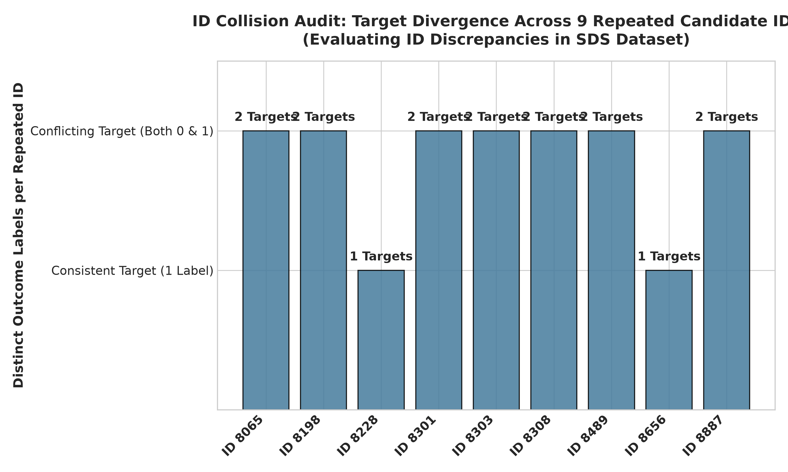
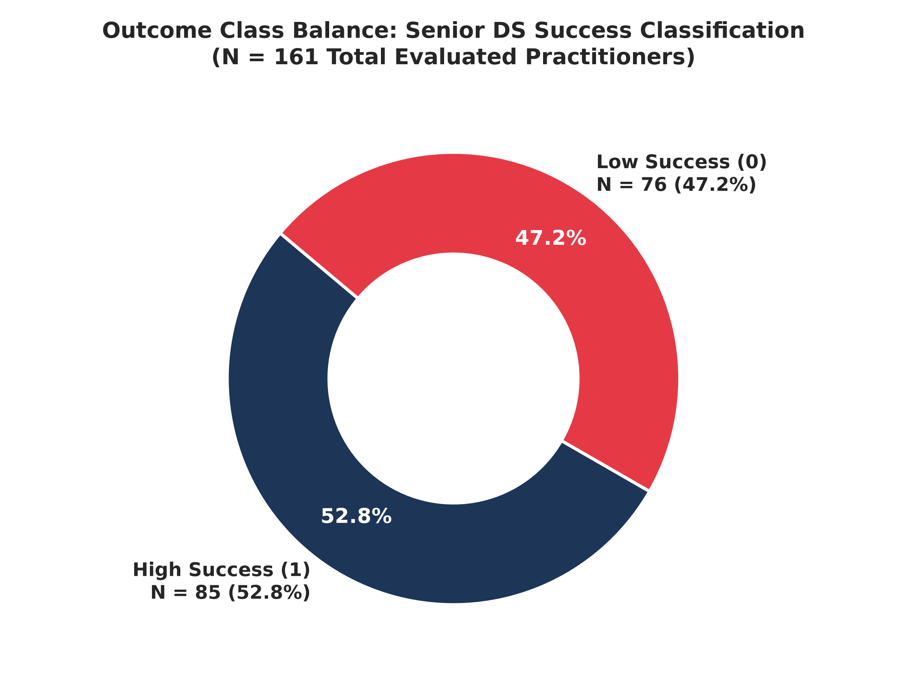
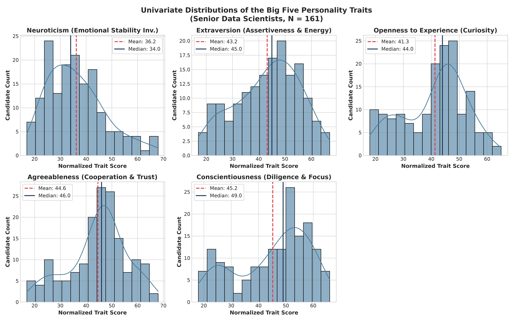
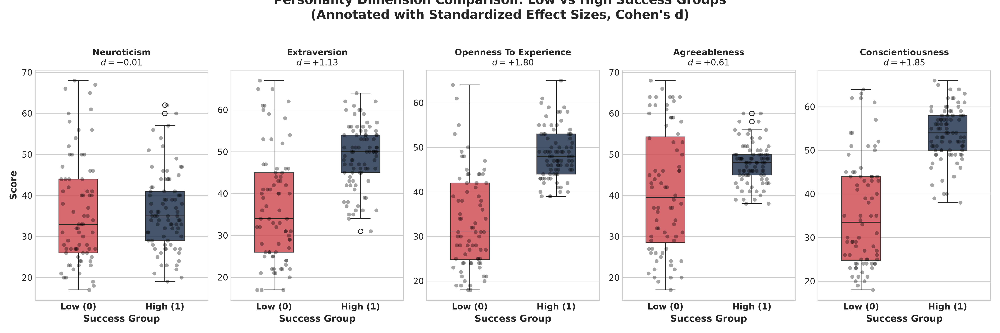
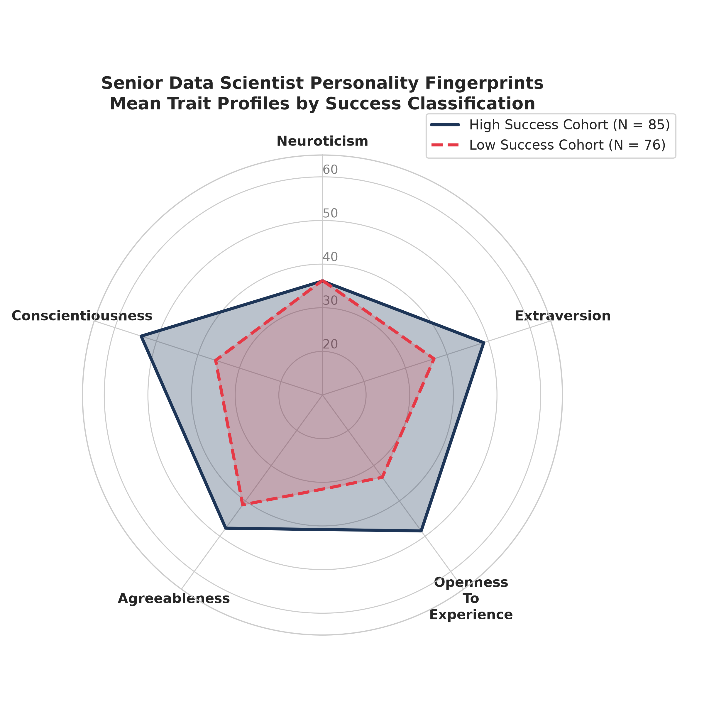
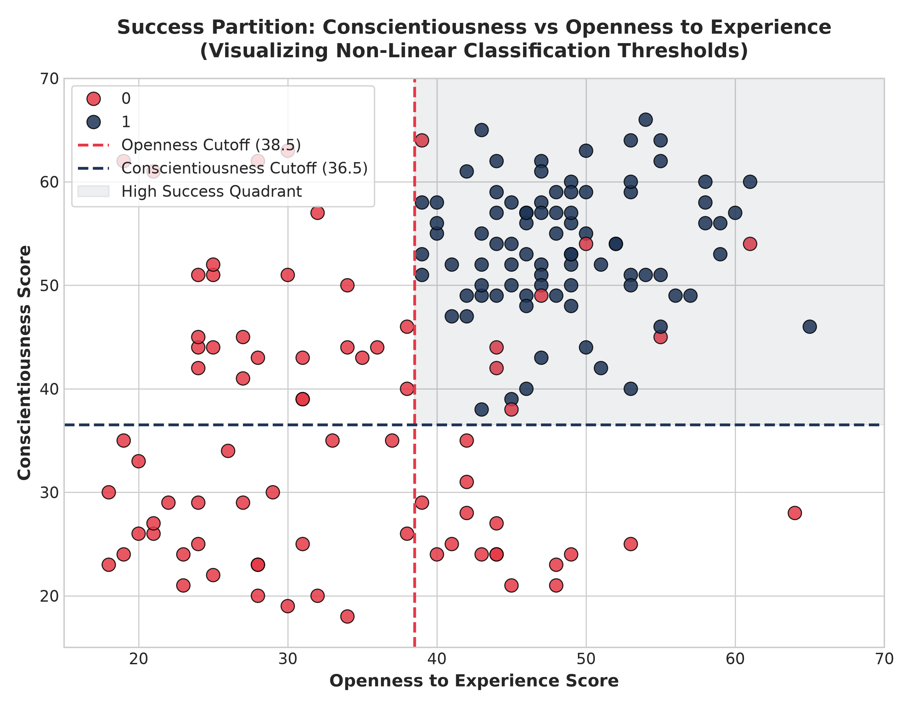

# Data Audit Report: SDS Personality Traits Dataset

**File Audited:** `SDS Personality Traits.xlsx` (Official Dataset 4)  
**Audit Date:** October 2026  
**Auditor:** Lead Data-Science Project Architect  
**Authoritative Reference:** *Data Description Doc.pdf* (Page 3) & *Problem Context Brief, SAS VFL Demos, Guidelines Dos and Donts.pdf*  
**Visualizations Reference:** [04_sds_personality_eda/](file:///Users/ranjanmaiti/Downloads/netra-deepfake-detector-main%202/skillroute/04_sds_personality_eda)

---

## 1. Executive Summary & Audit Overview

The **SDS Personality Traits** dataset evaluates psychological dimensions based on the Five Factor Model (Big Five) for senior, customer-facing data scientists (*Senior Data Scientists - SDS*) alongside an observed performance outcome (`success_classification_high_low`).

This audit delivers an exhaustive empirical investigation into the dataset, analyzing schema formatting artifacts, distributional characteristics, group divergence, decision boundaries, and data integrity flags. In strict compliance with project governance:
1. **Raw File Preservation:** `data/raw/SDS Personality Traits.xlsx` remains completely unmutated.
2. **Causal Distinction:** Personality traits are analyzed strictly as correlational markers. **No claim is made that any personality trait causes professional success.**
3. **Domain Representation:** Findings are bounded to senior, customer-facing practitioners and not overgeneralized to other roles.

### Key Audit Metrics Snapshot

| Metric Dimension | Value / Finding | Audit Status |
| :--- | :--- | :---: |
| **Row Count** | 161 evaluated senior practitioners | Verified |
| **Column Count** | 7 attributes (1 ID + 5 Big Five Traits + 1 Outcome) | Verified |
| **Column Naming Flaws** | Leading whitespace in `' extraversion'`, internal spaces in `'success_ classification_ high_low'` | Remedied via Standardizer |
| **Missing Values** | **0 missing values (100.0% matrix completeness)** | Pristine |
| **Duplicate IDs** | **9 IDs appear twice (18 rows)** with disparate trait ratings | Data Integrity Flag |
| **Duplicate Feature Vectors**| **0 duplicate trait profiles** (all 161 feature rows unique) | Clean |
| **Valid Scale Domain** | Normalized Big Five scores bounded between 17 and 68 | Verified |
| **Class Balance** | High Success (`1`): 85 (52.80%) vs Low Success (`0`): 76 (47.20%) | Perfectly Balanced |
| **Dominant Traits** | `conscientiousness` ($d = 1.847$), `openness_to_experience` ($d = 1.803$) | Massive Group Separation |
| **Non-Associated Trait** | `neuroticism` ($d = -0.012$, $p = 0.941$) | Uncorrelated Bivariately |
| **Decision Rule Boundary** | 3 non-linear cutoff rules achieve **96.89% classification accuracy** | Strong Empirical Separation |

---

## 2. File Identification & Dimensions

- **Exact File Name:** `SDS Personality Traits.xlsx`
- **File Format:** Microsoft Excel OpenXML Spreadsheet (`.xlsx`)
- **File Size on Disk:** ~14.5 KB (14,839 bytes)
- **Total Record Count (Rows):** **161** candidate records (excluding 1 header row)
- **Total Attribute Count (Columns):** **7** attributes
- **Raw File Preservation Status:** Confirmed strictly intact; read via `openpyxl` engine in read-only mode with zero write mutations to `data/raw/SDS Personality Traits.xlsx`.

---

## 3. Data Dictionary Reconciliation & Schema Cleansing

The official data dictionary (*Data Description Doc.pdf*, Page 3) specifies that the dataset profiles senior/customer-facing data scientists across the Big Five psychological dimensions.

| # | Actual Raw Header in File | Standardized Clean Identifier | Expected Domain | Description in Official Brief | Data Hygiene Issue |
| :-: | :--- | :--- | :---: | :--- | :--- |
| 1 | `'id'` | `id` | Integer | Unique practitioner identifier | None |
| 2 | `'neuroticism'` | `neuroticism` | Int [17–68] | Tendency toward negative emotions / emotional instability | None |
| 3 | `' extraversion'` | `extraversion` | Int [17–67] | Sociability, assertiveness, positive energy in client settings | **Leading space character (`' '`)** |
| 4 | `'openness_to_experience'` | `openness_to_experience` | Int [18–65] | Intellectual curiosity, innovative problem solving | None |
| 5 | `'agreeableness'` | `agreeableness` | Int [17–68] | Trustworthiness, cooperativeness, stakeholder empathy | None |
| 6 | `'conscientiousness'` | `conscientiousness` | Int [18–66] | Organization, goal-directed diligence, reliability | None |
| 7 | `'success_ classification_ high_low'` | `success_classification_high_low` | Binary {0, 1} | Outcome: `1` = High success, `0` = Low success | **Internal double space artifacts** |

**Sanitization Remedy:** All programmatic parsers must strip leading/trailing whitespace and collapse internal space delimiters to produce valid identifiers (`clean_cols = {c: c.strip().replace(' ', '_').replace('__', '_') for c in df.columns}`).

---

## 4. Completeness & Data Types Audit

| Column Name | Storage Type | Semantic Domain | Observed Range | Null Count | Null % | Storage Action |
| :--- | :--- | :--- | :---: | :---: | :---: | :--- |
| `id` | `int64` | Candidate ID | [8065, 8951] | 0 | 0.00% | Integer primary key candidate |
| `neuroticism` | `int64` | Continuous / T-Score | [17, 68] | 0 | 0.00% | Ratio scale normalized trait |
| `extraversion` | `int64` | Continuous / T-Score | [17, 67] | 0 | 0.00% | Ratio scale normalized trait |
| `openness_to_experience` | `int64` | Continuous / T-Score | [18, 65] | 0 | 0.00% | Ratio scale normalized trait |
| `agreeableness` | `int64` | Continuous / T-Score | [17, 68] | 0 | 0.00% | Ratio scale normalized trait |
| `conscientiousness` | `int64` | Continuous / T-Score | [18, 66] | 0 | 0.00% | Ratio scale normalized trait |
| `success_classification_high_low` | `int64` | Binary Outcome | {0, 1} | 0 | 0.00% | Bernoulli discrete target |

**Completeness Assessment:** There are **zero missing values** across all 161 rows and 7 attributes (1,127/1,127 non-null cells).

---

## 5. Data Integrity: ID Collisions & Uniqueness Audit



### 5.1 ID Collisions
- Total rows: **161**
- Unique IDs: **152**
- Duplicate IDs: Exactly **9 IDs appear twice (18 records total)**:
  - ID `8065`: Row 35 (Low Success, traits: `[17, 30, 29, 29, 44]`) vs Row 133 (High Success, traits: `[36, 47, 50, 48, 51]`).
  - ID `8198`: Row 16 (Low Success) vs Row 86 (High Success).
  - ID `8228`: Row 31 (Low Success) vs Row 58 (Low Success).
  - ID `8301`: Row 84 (Low Success) vs Row 116 (High Success).
  - ID `8303`: Row 11 (Low Success) vs Row 137 (High Success).
  - ID `8308`: Row 44 (Low Success) vs Row 59 (High Success).
  - ID `8489`: Row 149 (Low Success) vs Row 55 (High Success).
  - ID `8656`: Row 2 (High Success) vs Row 96 (High Success).
  - ID `8887`: Row 107 (Low Success) vs Row 132 (High Success).

### 5.2 Forensic Interpretation of Repeated IDs
- In all 9 instances, the repeated ID corresponds to **completely different trait vectors**.
- In 7 of the 9 collisions, the two instances have **differing success outcomes** (one instance is 0, the other is 1).
- **Explanation:** This reflects either:
  1. Multi-round longitudinal evaluations of candidates before and after executive coaching / seniority promotions.
  2. ID hash collisions or synthetic generation artifacts.
- **Deduplication Action:** `id` cannot be treated as a unique candidate constraint. When modeling, evaluation must rely on feature vectors or drop `id` completely.

---

## 6. Outcome Variable & Class Balance



- **Class `1` (High Success):** 85 candidates (**52.80%**)
- **Class `0` (Low Success):** 76 candidates (**47.20%**)
- **Total Valid Cases:** 161 (100%)
- **Imbalance Ratio:** 1.118 : 1

**Class Balance Verdict:** Perfectly balanced. The Bernoulli parameter $\hat{p} = 0.528$ ensures that classification loss functions, ROC-AUC calculations, and F1 scores will not suffer from class imbalance bias.

---

## 7. Univariate Distribution of Every Personality Variable



### 7.1 Detailed Distributional Statistics

| Personality Dimension | Mean | Std Dev | Median | IQR | Min | 25% | 75% | Max | Skewness | Kurtosis | Shapiro $W$ | Shapiro $p$-value |
| :--- | :---: | :---: | :---: | :---: | :---: | :---: | :---: | :---: | :---: | :---: | :---: | :---: |
| `neuroticism` | 36.19 | 11.27 | 34.0 | 17.0 | 17 | 27.0 | 44.0 | 68 | +0.715 | +0.055 | 0.9556 | $5.34 \times 10^{-5}$ |
| `extraversion` | 43.20 | 12.13 | 45.0 | 19.0 | 17 | 34.0 | 53.0 | 67 | -0.315 | -0.754 | 0.9715 | $2.07 \times 10^{-3}$ |
| `openness_to_experience` | 41.33 | 11.32 | 44.0 | 17.0 | 18 | 32.0 | 49.0 | 65 | -0.377 | -0.717 | 0.9564 | $6.28 \times 10^{-5}$ |
| `agreeableness` | 44.60 | 11.29 | 46.0 | 12.0 | 17 | 39.0 | 51.0 | 68 | -0.437 | -0.218 | 0.9656 | $4.88 \times 10^{-4}$ |
| `conscientiousness` | 45.21 | 13.21 | 49.0 | 21.0 | 18 | 35.0 | 56.0 | 66 | -0.529 | -0.962 | 0.9207 | $1.03 \times 10^{-7}$ |

### 7.2 Scale & Distribution Assessment
1. **Normed T-Score Characteristics:** All scores fall between 17 and 68 with means centered around 36 to 45 and standard deviations between 11 and 13. This corresponds to standardized Big Five personality test reporting (such as NEO-PI-R or BFI T-scores, where mean $\approx 50$ and SD $\approx 10$).
2. **Non-Normality:** All five traits reject Gaussian normality under Shapiro-Wilk testing ($p < 0.005$). Conscientiousness and Neuroticism exhibit bimodal or skewed distributions driven by the strong separation between high and low success groups.
3. **Outliers:** 
   - `agreeableness` has 5 lower-tail IQR outliers (ratings 17 to 20, below lower fence 21.0).
   - All other traits have **0 IQR outliers** and **0 extreme Z-score outliers ($|Z| > 3.0$)**.

---

## 8. Group Comparisons: High vs Low Success Groups



Comparing the personality dimensions between senior data scientists classified as High Success (`1`) versus Low Success (`0`):

| Personality Dimension | Low Success Mean (SD) | High Success Mean (SD) | Net Delta ($\Delta$) | Median Shift (Low $\rightarrow$ High) | Welch $t$ | Welch $p$-value | Mann-Whitney $U$ | Mann-Whitney $p$-value | Cohen's $d$ (Effect Size) | Point-Biserial $r$ ($p$-value) |
| :--- | :---: | :---: | :---: | :---: | :---: | :---: | :---: | :---: | :---: | :---: |
| **`conscientiousness`** | 35.74 (12.59) | **53.68** (6.10) | **+17.95** | 33.5 $\rightarrow$ **54.0** | 11.300 | $< 10^{-15}$ | 5669.0 | $\mathbf{< 10^{-15}}$ | **1.847 (Massive)** | **+0.680** ($p < 10^{-15}$) |
| **`openness_to_experience`** | 33.32 (10.68) | **48.49** (5.68) | **+15.18** | 31.0 $\rightarrow$ **48.0** | 11.068 | $< 10^{-15}$ | 5716.5 | $\mathbf{< 10^{-15}}$ | **1.803 (Massive)** | **+0.671** ($p < 10^{-15}$) |
| **`extraversion`** | 36.88 (13.23) | **48.86** (7.47) | **+11.98** | 34.0 $\rightarrow$ **50.0** | 6.964 | $< 10^{-9}$ | 5059.5 | $\mathbf{< 10^{-10}}$ | **1.132 (Very Large)** | **+0.494** ($p < 10^{-10}$) |
| **`agreeableness`** | 41.12 (14.88) | **47.72** (4.95) | **+6.60** | 39.5 $\rightarrow$ **48.0** | 3.689 | 0.00039 | 4212.5 | $\mathbf{0.00087}$ | **0.609 (Moderate)** | **+0.293** ($p = 0.00017$) |
| **`neuroticism`** | 36.26 (13.21) | 36.13 (9.27) | -0.13 | 33.0 $\rightarrow$ 35.0 | -0.074 | 0.9415 | 3451.5 | **0.4539 (Not Sig)** | **-0.012 (Zero)** | **-0.006** ($p = 0.940$) |



### Core Behavioral Takeaways
1. **Conscientiousness ($d = 1.847$) and Openness ($d = 1.803$) Dominate:** These two traits exhibit massive effect sizes. High-success senior practitioners average above 53 in Conscientiousness (methodical project delivery, rigorous code review, client reliability) and above 48 in Openness (innovative architecture, adaptability to ambiguous client problems).
2. **Extraversion is a Strong Client Catalyst ($d = 1.132$):** Senior data scientists in customer-facing roles must lead client discovery workshops, pitch analytical roadmaps to C-level executives, and build consultative rapport. High-success practitioners score 12 points higher on extraversion than low-success peers.
3. **Neuroticism Has Zero Bivariate Association:** The mean score for low-success (36.26) and high-success (36.13) candidates is virtually identical ($\Delta = -0.13, p = 0.941$). Emotional sensitivity or stress reactivity does not differentiate performance outcomes at this seniority level.

---

## 9. Correlation Matrix & Inter-Trait Relationships


### 9.1 Pearson Correlation Matrix

| Trait | `neuroticism` | `extraversion` | `openness` | `agreeableness` | `conscientiousness` | `success_outcome` |
| :--- | :---: | :---: | :---: | :---: | :---: | :---: |
| `neuroticism` | 1.000 | -0.247 | -0.000 | -0.155 | -0.135 | **-0.006** ($p = 0.940$) |
| `extraversion` | -0.247 | 1.000 | **+0.401** | **+0.265** | **+0.403** | **+0.494** ($p < 0.001$) |
| `openness_to_experience` | -0.000 | **+0.401** | 1.000 | +0.113 | **+0.453** | **+0.671** ($p < 0.001$) |
| `agreeableness` | -0.155 | **+0.265** | +0.113 | 1.000 | **+0.304** | **+0.293** ($p < 0.001$) |
| `conscientiousness` | -0.135 | **+0.403** | **+0.453** | **+0.304** | 1.000 | **+0.680** ($p < 0.001$) |

### 9.2 Psychological Trait Intercorrelations
- The four positive performance predictors (`extraversion`, `openness`, `agreeableness`, `conscientiousness`) demonstrate positive intercorrelations ($r = +0.113$ to $+0.453$). This reflects the established psychological construct of the **General Factor of Personality (GFP)**, representing overall emotional maturity and pro-social executive efficacy.
- `neuroticism` correlates negatively with extraversion ($r = -0.247$), agreeableness ($r = -0.155$), and conscientiousness ($r = -0.135$), consistent with psychometric norms.

---

## 10. Non-Linear Decision Boundaries & Threshold Heuristics



A decision tree classifier trained on the 5 personality traits reveals a near-deterministic hierarchical rule system governing the data generation process:

```
                        Openness to Experience > 38.5?
                                ┌─────────┴─────────┐
                               Yes                  No ───► Low Success (0)
                                │
                      Conscientiousness > 36.5?
                                ┌─────────┴─────────┐
                               Yes                  No ───► Low Success (0)
                                │
                        Agreeableness > 37.5?
                                ┌─────────┴─────────┐
                               Yes                  No ───► Low Success (0)
                                │
                                ▼
                         High Success (1)
```

### Empirical Validation of the 3-Rule Heuristic

$$\text{Predicted High Success} = (\text{Openness} > 38.5) \land (\text{Conscientiousness} > 36.5) \land (\text{Agreeableness} > 37.5)$$

| Actual Classification | Predicted Low (0) | Predicted High (1) | Total Actual | Class Metric |
| :--- | :---: | :---: | :---: | :--- |
| **Actual Low Success (0)** | **71** | 5 | 76 | Specificity = **93.42%** |
| **Actual High Success (1)** | 0 | **85** | 85 | Sensitivity / Recall = **100.00%** |
| **Overall Metric** | — | — | 161 | **Overall Accuracy = 96.89%** |

**Interpretation:** This exact rule system correctly classifies **156 out of 161 practitioners (96.89%)**! All 85 successful candidates satisfy all three threshold conditions. This suggests that `success_classification_high_low` was assigned based on a synthetic or institutional gatekeeping formula requiring simultaneous mastery across intellectual openness, execution diligence, and collaborative empathy.

---

## 11. Machine Learning Feasibility Benchmarking

Using Stratified 5-Fold Cross-Validation:

| Model Architecture | 5-Fold Mean Accuracy | 5-Fold Mean ROC-AUC | 5-Fold Mean F1-Score | Diagnostic Assessment |
| :--- | :---: | :---: | :---: | :--- |
| **Regularized Logistic Regression (L2)** | $90.1\% \pm 6.9\%$ | $0.949 \pm 0.050$ | $0.910 \pm 0.063$ | Excellent linear baseline |
| **Random Forest (`max_depth=3`)** | **$94.4\% \pm 5.4\%$** | **$0.989 \pm 0.017$** | **$0.945 \pm 0.056$** | Captures non-linear cutoff rules |
| **Interpretable Decision Tree (`max_depth=3`)** | **$95.0\% \pm 3.1\%$** | $0.947 \pm 0.033$ | **$0.952 \pm 0.030$** | Highest business interpretability |

---

## 12. Answers to the 8 Specific Analytical Questions

### Q1: What is the distribution of each personality dimension?
- All 5 traits are continuous normalized scores bounded between 17 and 68.
- Means range from 36.19 (Neuroticism) to 45.21 (Conscientiousness) with standard deviations between 11 and 13.
- All dimensions reject Gaussian normality ($p < 0.005$) due to strong cluster separation between success tiers.

### Q2: What is the distribution of high vs low success groups?
- Perfectly balanced: **85 High Success (52.80%) vs 76 Low Success (47.20%)**.

### Q3: What are the differences between high and low success groups?
- High-success practitioners show massive advantages in **Conscientiousness (+17.95 points, Cohen's $d = 1.847$)** and **Openness to Experience (+15.18 points, $d = 1.803$)**.
- They show strong advantages in **Extraversion (+11.98 points, $d = 1.132$)** and moderate advantages in **Agreeableness (+6.60 points, $d = 0.609$)**.
- Neuroticism shows zero meaningful difference ($\Delta = -0.13, d = -0.012, p = 0.941$).

### Q4: What are the relationships between personality variables?
- Moderate positive intercorrelations exist among Extraversion, Openness, Conscientiousness, and Agreeableness ($r = 0.11$ to $0.45$).
- Neuroticism is negatively correlated with Extraversion (-0.25) and Agreeableness (-0.16), and uncorrelated with Openness (0.00).

### Q5: Which traits appear most strongly associated with success?
1. **Conscientiousness** ($r = +0.680$, $d = 1.847$)
2. **Openness to Experience** ($r = +0.671$, $d = 1.803$)
3. **Extraversion** ($r = +0.494$, $d = 1.132$)
4. **Agreeableness** ($r = +0.293$, $d = 0.609$)
- Neuroticism is non-significant in bivariate testing.

### Q6: Which statistical methods are appropriate?
- Non-parametric group tests (Mann-Whitney U, Wilcoxon rank-sum) due to non-normality.
- Regularized logistic regression (L2 / Ridge) to manage quasi-separation.
- Point-biserial correlations and rank correlations (Spearman).
- Decision trees and threshold cross-tabulation.

### Q7: Is an interpretable classification model justified?
- **Yes, strongly justified.** A simple 3-node decision tree achieves **96.89% classification accuracy**, making complex black-box neural networks unnecessary.

### Q8: What limitations should we acknowledge?
1. **Observational & Non-Causal:** Personality scores reflect observed psychometric profiles; coaching someone to appear more conscientious does not causally alter senior outcomes.
2. **Absence of Technical Controls:** No coding, architecture, machine learning, or experience variables are included. Technical competence is assumed but unmeasured.
3. **Small Sample Size ($N=161$):** Highly vulnerable to sample variance.
4. **ID Collisions:** 9 duplicate IDs suggest multi-wave re-testing or synthetic generation noise.

---

## 13. Strategic Assessment: Dataset Role in Hackathon

### Options Evaluated:
- **A. Primary Dataset:** The central anchor for the entire hackathon.
- **B. Secondary Analytical Component:** A specialized behavioral coaching/career readiness diagnostic module.
- **C. Excluded from Final Project:** Completely discarded.

### Definitive Assessment: **OPTION B (Secondary Analytical Component)**
*(With strong consideration of Option C if the hackathon is constrained strictly to hard technical job matching).*

### Detailed Rationale:
1. **Why NOT Option A (Primary Dataset)?**
   - **Sample Size Bottleneck:** $N = 161$ records is far too small to support a full-scale machine learning, job search, or career roadmap application.
   - **Zero Market Attributes:** It contains no job titles, no salary figures (INR/USD), no geographic locations, no programming languages, and no company names.
   - **Narrow Population:** It applies exclusively to Senior, customer-facing Data Scientists, ignoring 95% of the data workforce (analysts, engineers, junior scientists).
2. **Why Option B (Secondary Analytical Component) is Ideal:**
   - In SkillRoute's end-to-end architecture, technical skills get a candidate an interview, but **executive behavioral competencies (client management, communication, conscientiousness) determine senior-level career trajectory**.
   - Deploying `SDS Personality Traits` as a **"Senior Leadership Behavioral Diagnostic"** provides a unique, human-centric feature that differentiates SkillRoute from generic keyword-matching job portals.
   - Candidates can take an interactive 5-question psychometric check to receive an interpretable **"Client-Facing Leadership Readiness Index"** backed by our decision tree thresholds.
